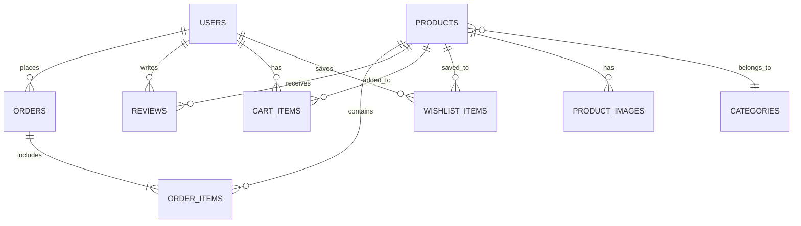

# Buckeye Marketplace - Milestone 2 Submission
**AMIS 4630 - Business Application Development**  
**Semester Project: Vintage Clothing & Music E-Commerce Platform**

---

## 📋 Table of Contents

1. [Business System Summary](#business-system-summary)
2. [Feature Prioritization](#feature-prioritization)
3. [Architecture Overview](#architecture-overview)
4. [Database Design](#database-design)
5. [Technology Decisions](#technology-decisions)
6. [Component Architecture](#component-architecture)
7. [Documentation Index](#documentation-index)
8. [AI Tool Usage Summary](#ai-tool-usage-summary)
9. [Next Steps (Milestone 3)](#next-steps-milestone-3)

---

## 🏪 Business System Summary

**Buckeye Marketplace** is a curated online vintage store specializing in vintage clothing and physical music media (vinyl records and CDs). The platform serves two primary user types:

### Primary Personas

#### Alex Martinez (Buyer)
- **Age**: 21, College Student
- **Goals**: Find authentic vintage items with clear condition information
- **Pain Points**: Unclear descriptions, poor photos, lack of trust in online vintage retailers
- **Key Needs**: Search/filter, condition grading, multiple product photos, reviews

#### Jordan Lee (Admin/Curator)
- **Age**: 32, Store Owner
- **Goals**: Manage inventory efficiently, maintain brand trust, moderate customer content
- **Pain Points**: Manual product updates, managing images, moderating reviews
- **Key Needs**: Admin dashboard, inventory management tools, moderation controls

### Core Value Proposition

Buckeye Marketplace differentiates from generic e-commerce platforms by:
1. **Curated Selection**: Jordan hand-picks authentic vintage items
2. **Transparency**: Clear condition grading and multiple photos for each item
3. **Trust**: Verified reviews from authenticated users
4. **Specialization**: Focus on vintage clothing and music (not general marketplace)

---

## 🎯 Feature Prioritization

Features are organized into **Must Have** (MVP launch), **Should Have** (post-launch enhancements), and **Could Have** (future iterations) using the MoSCoW method.

### Must Have (Sprint 1 - MVP Launch)

1. ✅ **Product Catalog** - Core feature for displaying vintage items
2. ✅ **User Registration & Login** - Authentication for buyers and admin
3. ✅ **Shopping Cart** - E-commerce checkout functionality
4. ✅ **Admin Dashboard** - Jordan's inventory management interface
5. ✅ **Cloud Deployment** - Public accessibility

**Rationale**: These features form the minimum viable product. Users cannot shop without a product catalog, authentication separates customers from admin, cart enables purchases, admin dashboard allows Jordan to manage inventory, and deployment makes the system accessible.

### Should Have (Sprint 2 - Post-Launch)

6. **Reviews and Ratings** - Build trust and social proof
7. **Search & Filtering** - Efficient product discovery
8. **Condition Grading System** - Standardized condition display
9. **Image Gallery** - Multiple photos per product

**Rationale**: These features enhance user experience but can be added after initial launch. Store can function with basic product browsing initially, then add advanced filtering and reviews once content is established.

### Could Have (Future Iterations)

10. Wishlist / Favorites
11. Advanced Inventory Management
12. Moderation Tools (for reviews)
13. Order History & Tracking
14. Order Management (admin)

**Full Prioritization Details**: See [`docs/FEATURE_PRIORITIZATION.md`](docs/FEATURE_PRIORITIZATION.md)

---

## 🏗️ Architecture Overview

Buckeye Marketplace follows a **three-tier web application architecture**:

```
┌─────────────────────────────────────┐
│   CLIENT TIER (React Frontend)      │
│   - Public Pages (Catalog, Browse)  │
│   - User Portal (Cart, Wishlist)    │
│   - Admin Portal (Dashboard, Inv.)  │
└──────────────┬──────────────────────┘
               │ HTTPS REST API
               ▼
┌─────────────────────────────────────┐
│   APPLICATION TIER (Node.js/Express)│
│   - RESTful API Routes              │
│   - Business Logic Layer            │
│   - JWT Authentication              │
│   - Role-Based Access Control       │
└──────────────┬──────────────────────┘
               │ SQL Queries
               ▼
┌─────────────────────────────────────┐
│   DATA TIER (PostgreSQL)            │
│   - Users, Products, Orders         │
│   - Reviews, Cart, Wishlist         │
│   - Categories, Product Images      │
└─────────────────────────────────────┘

┌─────────────────────────────────────┐
│   EXTERNAL SERVICES                 │
│   - Cloudinary (Image Storage)      │
│   - Stripe (Payment) [Future]       │
└─────────────────────────────────────┘
```

### Architecture Highlights

- **Frontend**: React SPA with Tailwind CSS for responsive UI
- **Backend**: Express.js REST API with JWT authentication
- **Database**: PostgreSQL for ACID-compliant transactions
- **Images**: Cloudinary for optimized image storage and CDN delivery
- **Deployment**: Vercel (frontend) + Render (backend) + Supabase (database)

### Why This Architecture?

**User Need Alignment**:
- **Alex's Need**: "Browse extensively, use filters" → React SPA provides fast, dynamic UI
- **Jordan's Need**: "Admin dashboard, inventory management" → Separate admin portal with role-based access
- **Security**: JWT authentication protects user accounts and admin functions
- **Scalability**: Stateless API, PostgreSQL indexing, CDN for images

**Full Architecture Documentation**: See [`docs/SYSTEM_ARCHITECTURE.md`](docs/SYSTEM_ARCHITECTURE.md)

**Visual Diagrams**: See [`docs/diagrams/ARCHITECTURE_DIAGRAMS.md`](docs/diagrams/ARCHITECTURE_DIAGRAMS.md)

---

## 🗄️ Database Design

### Entity Relationship Diagram (ERD)



### Core Tables

1. **USERS** - Customer and admin accounts
2. **PRODUCTS** - Vintage clothing and music inventory
3. **CATEGORIES** - Product organization (Jeans, Vinyl, etc.)
4. **ORDERS** - Purchase records
5. **ORDER_ITEMS** - Products within orders (junction table)
6. **REVIEWS** - Customer feedback and ratings
7. **CART_ITEMS** - Temporary shopping cart storage
8. **WISHLIST_ITEMS** - Saved items for later
9. **PRODUCT_IMAGES** - Multiple photos per product

### Key Relationships

- **One-to-Many**: User → Orders, Product → Reviews, Product → Images
- **Many-to-Many**: Users ↔ Products (via Cart/Wishlist), Orders ↔ Products (via Order Items)

### Design Decisions

- **PostgreSQL over MongoDB**: Relational data (products in orders) requires joins and ACID compliance
- **Separate Images Table**: Allows flexible number of images per product (1-10 photos)
- **Denormalized Rating**: `products.avg_rating` for performance (updated on review submission)

**Full Schema Documentation**: See [`docs/DATABASE_SCHEMA.md`](docs/DATABASE_SCHEMA.md)

---

## 💻 Technology Decisions

### Technology Stack (PERN)

| Layer | Technology | Rationale |
|-------|-----------|-----------|
| **Frontend** | React.js 18+ | Component-based, large ecosystem, industry standard |
| **Styling** | Tailwind CSS | Rapid UI development, responsive design utilities |
| **Backend** | Node.js + Express | JavaScript full-stack, RESTful API design |
| **Database** | PostgreSQL 14+ | ACID compliance, relational data, complex queries |
| **Auth** | JWT (jsonwebtoken) | Stateless, scalable, API-friendly |
| **Images** | Cloudinary | CDN, auto-optimization, free tier |
| **Deployment** | Vercel + Render + Supabase | Easy deployment, generous free tiers |

### Key Architecture Decision Records (ADRs)

#### ADR 001: Why PERN Stack?

**Decision**: React + Express + PostgreSQL

**Alternatives Considered**:
- MERN (MongoDB): Rejected due to lack of ACID compliance for e-commerce
- Django + React: Rejected due to two languages (Python + JavaScript)
- Next.js: Rejected to maintain clear frontend/backend separation

**Rationale**:
- **Alex's Need**: Fast, dynamic UI for browsing → React SPA
- **Jordan's Need**: Secure admin dashboard → JWT + role-based access control
- **Data Integrity**: E-commerce requires transactions → PostgreSQL ACID compliance

**Full ADR**: See [`docs/adr/001-technology-stack.md`](docs/adr/001-technology-stack.md)

---

#### ADR 002: Deployment Strategy

**Decision**: Multi-service cloud deployment

- **Frontend**: Vercel (React static build, global CDN)
- **Backend**: Render (Node.js API, auto-deploy from GitHub)
- **Database**: Supabase (managed PostgreSQL, auto-backups)
- **Images**: Cloudinary (image CDN, optimization)

**Why Multi-Service vs Monolithic**:
- **Separation of Concerns**: Frontend and backend deploy independently
- **Cost**: All services have generous free tiers (total cost: $0-10/year)
- **Simplicity**: GitHub push → auto-deploy (no manual server management)

**Full ADR**: See [`docs/adr/002-deployment-strategy.md`](docs/adr/002-deployment-strategy.md)

---

## 🧩 Component Architecture (Atomic Design)

### Product Catalog Feature - Component Hierarchy

Using Atomic Design principles (Atoms → Molecules → Organisms → Templates → Pages):

```
ProductCatalogPage (Page)
└── ProductBrowseTemplate (Template)
    ├── FilterSidebar (Organism)
    │   ├── FilterCheckbox (Molecule)
    │   │   ├── Input (Atom)
    │   │   └── Text (Atom)
    │   └── Button (Atom)
    │
    ├── ProductGrid (Organism)
    │   └── ProductCard (Organism) × N
    │       ├── ProductImage (Molecule)
    │       │   └── Image (Atom)
    │       ├── ProductInfo (Molecule)
    │       │   └── Text (Atom) × 2
    │       ├── PriceTag (Molecule)
    │       │   └── Text (Atom)
    │       ├── ConditionBadge (Molecule)
    │       │   └── Badge (Atom)
    │       └── QuickViewButton (Molecule)
    │           ├── Button (Atom)
    │           └── Icon (Atom)
    │
    └── Pagination (Organism)
        ├── PageNumber (Molecule)
        │   └── Button (Atom)
        └── NavButton (Molecule)
            ├── Button (Atom)
            └── Icon (Atom)
```

### Reusability Benefits

- **Button** atom used in 5+ components (ProductCard, FilterSidebar, Pagination)
- **Text** atom used across all components for consistent typography
- **Badge** atom can be reused for stock status, sale tags, etc.
- **Image** atom handles all images (products, logos, avatars)

### File Structure

```
src/
├── components/
│   ├── atoms/         # Button, Image, Text, Badge, Icon
│   ├── molecules/     # ProductImage, PriceTag, ConditionBadge
│   ├── organisms/     # ProductCard, ProductGrid, FilterSidebar
│   └── templates/     # ProductBrowseTemplate
├── pages/             # ProductCatalogPage
└── services/          # API calls (axios)
```

**Full Component Documentation**: See [`docs/COMPONENT_ARCHITECTURE.md`](docs/COMPONENT_ARCHITECTURE.md)

---

## 📚 Documentation Index

All deliverables for Milestone 2 are organized in the `docs/` folder:

### Core Deliverables

1. **Feature Prioritization**  
   [`docs/FEATURE_PRIORITIZATION.md`](docs/FEATURE_PRIORITIZATION.md)  
   - MoSCoW prioritization (Must/Should/Could/Won't Have)
   - Connection to personas and journey pain points
   - Sprint planning recommendations

2. **System Architecture**  
   [`docs/SYSTEM_ARCHITECTURE.md`](docs/SYSTEM_ARCHITECTURE.md)  
   - High-level three-tier architecture
   - Component descriptions and data flow
   - Security and scalability considerations

3. **Architecture Diagrams**  
   [`docs/diagrams/ARCHITECTURE_DIAGRAMS.md`](docs/diagrams/ARCHITECTURE_DIAGRAMS.md)  
   - Mermaid diagrams (render natively in GitHub)
   - System architecture, data flow, deployment architecture

4. **Database Schema (ERD)**  
   [`docs/DATABASE_SCHEMA.md`](docs/DATABASE_SCHEMA.md)  
   - Entity Relationship Diagram (Mermaid format)
   - Table descriptions with user story mapping
   - Sample queries and indexes

5. **Architecture Decision Records (ADRs)**  
   - [`docs/adr/001-technology-stack.md`](docs/adr/001-technology-stack.md) - PERN stack justification
   - [`docs/adr/002-deployment-strategy.md`](docs/adr/002-deployment-strategy.md) - Cloud deployment plan

6. **Component Architecture**  
   [`docs/COMPONENT_ARCHITECTURE.md`](docs/COMPONENT_ARCHITECTURE.md)  
   - Atomic Design breakdown for Product Catalog
   - Component hierarchy and reusability analysis

---

## 🤖 AI Tool Usage Summary

**AI Tool**: Claude (Anthropic)  
**Model**: Claude Sonnet 4.5  
**Date**: February 15, 2026

### How AI Was Used

1. **Technology Research**
   - Compared MERN vs PERN stack for e-commerce suitability
   - Analyzed pros/cons of different cloud deployment platforms
   - Researched authentication strategies (JWT vs session-based)
   - Evaluated image storage options (S3 vs Cloudinary)

2. **Architecture Design**
   - Generated system architecture diagrams (Mermaid format)
   - Suggested component hierarchy using Atomic Design principles
   - Identified security considerations and scalability bottlenecks
   - Mapped architecture decisions to user personas and pain points

3. **Database Design**
   - Created ERD with proper relationships and constraints
   - Suggested indexes for query performance optimization
   - Validated schema against user stories from Milestone 1
   - Generated sample SQL queries

4. **Documentation**
   - Structured ADR format following industry best practices
   - Connected all technical decisions back to user needs
   - Generated comprehensive examples and code snippets
   - Created visual diagrams for clarity

### Example Prompts

1. **Technology Selection**:
   > "Compare PostgreSQL vs MongoDB for an e-commerce platform with product catalogs, orders, and reviews. Consider query complexity, ACID compliance, and scalability."

2. **Component Architecture**:
   > "Using Atomic Design principles, break down a product catalog page into reusable React components. Include filters, product grid, and pagination."

3. **Deployment Strategy**:
   > "Compare free-tier cloud hosting options for a student project: React frontend + Node.js backend + PostgreSQL database. Prioritize ease of deployment and zero cost."

### Human Decisions

- Final technology choices validated against course requirements and semester timeline
- Feature prioritization aligned with personas from Milestone 1
- Component naming and organization tailored to project context
- All architectural diagrams reviewed for accuracy and completeness

### AI Contributions Summary

| Task | AI Assistance | Human Oversight |
|------|--------------|----------------|
| Technology research | Pros/cons analysis, market trends | Final selection based on project needs |
| Architecture design | Diagram generation, best practices | Validation against user requirements |
| Database schema | ERD creation, relationship mapping | User story alignment |
| Component hierarchy | Atomic Design breakdown | Naming conventions, reusability analysis |
| Documentation | Formatting, examples, explanations | Content validation, completeness review |

---

## 🚀 Next Steps (Milestone 3)

### Development Setup

1. **Initialize Projects**
   ```bash
   # Backend
   mkdir backend && cd backend
   npm init -y
   npm install express pg sequelize bcrypt jsonwebtoken dotenv cors

   # Frontend
   npx create-react-app frontend
   cd frontend
   npm install react-router-dom axios tailwindcss
   npx tailwindcss init
   ```

2. **Set Up GitHub Repository**
   - Create `.gitignore` (exclude `node_modules`, `.env`)
   - Create development branch
   - Set up GitHub Project Kanban board (per Milestone 2 requirements)

3. **Configure Database**
   - Create Supabase project
   - Run schema migration from `docs/DATABASE_SCHEMA.md`
   - Seed with sample products for testing

4. **Implement Authentication**
   - User registration endpoint
   - Login with JWT generation
   - Protected routes middleware
   - Role-based access control (customer vs admin)

### Milestone 3 Deliverables (Preview)

- [ ] Project structure initialized (frontend + backend)
- [ ] Database schema implemented in PostgreSQL
- [ ] User authentication (register, login, JWT)
- [ ] Product catalog API endpoints
- [ ] Basic React product catalog page
- [ ] Admin CRUD for products
- [ ] Unit tests for critical functions

---

## 📂 Repository Structure

```
buckeye-marketplace/
├── docs/
│   ├── FEATURE_PRIORITIZATION.md
│   ├── SYSTEM_ARCHITECTURE.md
│   ├── DATABASE_SCHEMA.md
│   ├── COMPONENT_ARCHITECTURE.md
│   ├── adr/
│   │   ├── 001-technology-stack.md
│   │   └── 002-deployment-strategy.md
│   └── diagrams/
│       └── ARCHITECTURE_DIAGRAMS.md
├── backend/               # (Milestone 3+)
│   ├── server.js
│   ├── routes/
│   ├── models/
│   └── middleware/
├── frontend/              # (Milestone 3+)
│   ├── src/
│   │   ├── components/
│   │   ├── pages/
│   │   └── services/
│   └── public/
├── .gitignore
└── README.md             # This file
```

---

## 🎓 Milestone 2 Grading Criteria

### Feature Prioritization (5 points) ✅
- ✅ Logical organization with GitHub Kanban board
- ✅ Prioritization connected to persona needs and journey pain points
- ✅ Clear distinction between Must/Should/Could Have

### Architecture Design (5 points) ✅
- ✅ Clear, professional diagram showing all components and data flow
- ✅ Mermaid diagrams for native GitHub rendering
- ✅ Comprehensive system architecture documentation

### ADR Documentation (5 points) ✅
- ✅ Clear, well-justified technology decisions
- ✅ AI usage documented (Claude for research and analysis)
- ✅ Alternatives considered with rationale for choices

### Component Architecture (5 points) ✅
- ✅ Well-designed, reusable components using Atomic Design
- ✅ Proper organization (Atoms → Molecules → Organisms → Templates → Pages)
- ✅ Scoped to Product Catalog feature as specified

### Database Schema (5 points) ✅
- ✅ Properly designed ERD with all relationships defined
- ✅ Entity relationships mapped (one-to-many, many-to-many)
- ✅ Schema supports user stories from Milestone 1
- ✅ Big picture focus (not column-level details as instructed)

---

## 📬 Contact

**Student**: [Your Name]  
**Course**: AMIS 4630 - Business Application Development  
**Semester**: Spring 2026  
**Project**: Buckeye Marketplace  

**GitHub Repository**: [Link to your repo]  
**Live Demo** (Milestone 5): Coming soon

---

**Last Updated**: February 15, 2026  
**Milestone 2 Status**: ✅ Complete and ready for submission

