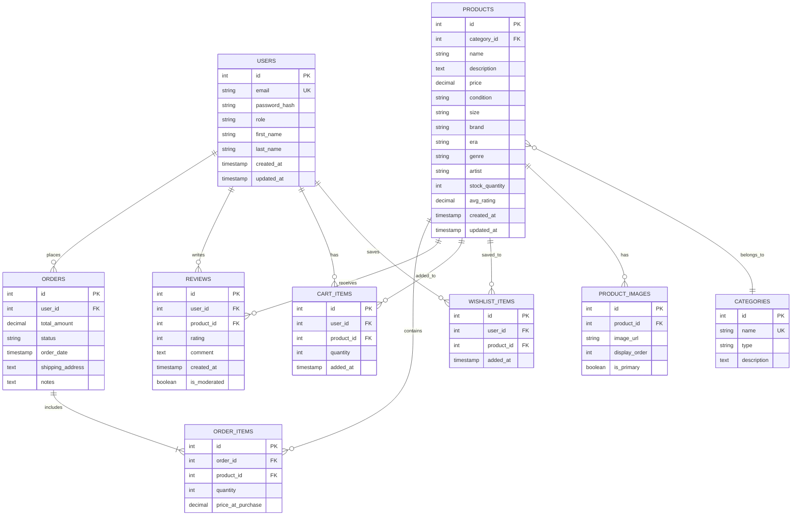

# Database Schema Design (ERD)
**Buckeye Marketplace - Vintage Clothing & Music Store**

## Entity Relationship Diagram



---

## Table Descriptions

### USERS
**Purpose**: Store customer and admin account information

**Key Relationships**:
- **One-to-Many** with ORDERS: A user can place multiple orders
- **One-to-Many** with REVIEWS: A user can write multiple reviews
- **One-to-Many** with CART_ITEMS: A user has a cart with multiple items
- **One-to-Many** with WISHLIST_ITEMS: A user can save multiple items to wishlist

**User Story Support**:
- **US-05**: User Authentication → Stores credentials and role
- **US-08**: Admin Manage Inventory → Role field distinguishes admin from customer
- **US-07**: Leave Reviews → user_id links reviews to authenticated users

**Fields**:
- `id`: Primary key (auto-increment)
- `email`: Unique identifier for login
- `password_hash`: Bcrypt hashed password (never store plain text)
- `role`: ENUM('customer', 'admin') - Determines access level
- `first_name`, `last_name`: User profile information
- `created_at`, `updated_at`: Audit timestamps

---

### PRODUCTS
**Purpose**: Store vintage clothing and music inventory

**Key Relationships**:
- **Many-to-One** with CATEGORIES: Product belongs to one category
- **One-to-Many** with ORDER_ITEMS: Product can be in multiple orders
- **One-to-Many** with REVIEWS: Product can have multiple reviews
- **One-to-Many** with CART_ITEMS: Product can be in multiple carts
- **One-to-Many** with WISHLIST_ITEMS: Product can be saved by multiple users
- **One-to-Many** with PRODUCT_IMAGES: Product can have multiple images

**User Story Support**:
- **US-01**: Browse Product Catalog → Core entity for catalog
- **US-03**: View Product Details with Condition → Stores condition grading
- **US-02**: Search & Filter → Indexed fields for search/filter (brand, era, genre, condition)
- **US-08**: Admin Manage Inventory → CRUD operations on this table

**Fields**:
- `id`: Primary key
- `category_id`: Foreign key to CATEGORIES
- `name`: Product title (e.g., "Vintage Levi's 501 Jeans" or "Pink Floyd - Dark Side of the Moon Vinyl")
- `description`: Detailed product description
- `price`: Decimal (10,2) for currency
- `condition`: ENUM('like-new', 'good', 'fair', 'worn') - Addresses Alex's pain point
- `size`: For clothing (e.g., "M", "32x34", "Large")
- `brand`: For clothing (e.g., "Levi's", "Nike")
- `era`: For clothing (e.g., "1980s", "1990s")
- `genre`: For music (e.g., "Rock", "Jazz", "Hip-Hop")
- `artist`: For music (e.g., "Pink Floyd", "Miles Davis")
- `stock_quantity`: Inventory tracking (most vintage items = 1)
- `avg_rating`: Denormalized field for performance (calculated from REVIEWS)
- `created_at`, `updated_at`: Audit timestamps

---

### CATEGORIES
**Purpose**: Organize products into clothing and music types

**Key Relationships**:
- **One-to-Many** with PRODUCTS: Category can have multiple products

**User Story Support**:
- **US-02**: Search & Filter Products → Filter by category
- **US-01**: Browse Product Catalog → Navigate by category

**Fields**:
- `id`: Primary key
- `name`: Category name (e.g., "Jeans", "Vinyl Records", "T-Shirts", "CDs")
- `type`: ENUM('clothing', 'music') - High-level grouping
- `description`: Category description for browsing

**Example Data**:
```
id | name              | type     | description
---|-------------------|----------|----------------------------------
1  | Jeans             | clothing | Vintage denim jeans
2  | T-Shirts          | clothing | Vintage graphic and band tees
3  | Jackets           | clothing | Vintage outerwear
4  | Vinyl Records     | music    | Vinyl LPs and singles
5  | CDs               | music    | Compact discs
6  | Cassette Tapes    | music    | Vintage cassettes
```

---

### ORDERS
**Purpose**: Track customer purchases

**Key Relationships**:
- **Many-to-One** with USERS: Order placed by one user
- **One-to-Many** with ORDER_ITEMS: Order contains multiple items

**User Story Support**:
- **US-04**: Add Items to Shopping Cart → Orders created from cart at checkout
- Future: Order history and tracking

**Fields**:
- `id`: Primary key
- `user_id`: Foreign key to USERS (who placed the order)
- `total_amount`: Decimal (10,2) total cost
- `status`: ENUM('pending', 'processing', 'shipped', 'delivered', 'cancelled')
- `order_date`: Timestamp of purchase
- `shipping_address`: Text field for delivery address
- `notes`: Optional order notes

---

### ORDER_ITEMS
**Purpose**: Link products to orders (junction table + details)

**Key Relationships**:
- **Many-to-One** with ORDERS: Item belongs to one order
- **Many-to-One** with PRODUCTS: References a product

**User Story Support**:
- **US-04**: Add Items to Shopping Cart → Cart items converted to order items at checkout

**Why This Table Exists**:
- **Many-to-Many**: Orders can have multiple products, products can be in multiple orders
- **Price History**: `price_at_purchase` preserves price at time of sale (even if product price changes later)

**Fields**:
- `id`: Primary key
- `order_id`: Foreign key to ORDERS
- `product_id`: Foreign key to PRODUCTS
- `quantity`: Number of items (usually 1 for vintage one-of-a-kind items)
- `price_at_purchase`: Price at time of order (immutable)

---

### REVIEWS
**Purpose**: Store customer product reviews and ratings

**Key Relationships**:
- **Many-to-One** with USERS: Review written by one user
- **Many-to-One** with PRODUCTS: Review is for one product

**User Story Support**:
- **US-07**: Leave Reviews and Ratings → Core review storage
- **US-09**: Admin Moderation → `is_moderated` flag for admin control
- **US-03**: View Product Details → Display reviews on product page

**Fields**:
- `id`: Primary key
- `user_id`: Foreign key to USERS (who wrote the review)
- `product_id`: Foreign key to PRODUCTS (product being reviewed)
- `rating`: Integer 1-5 stars
- `comment`: Text review content (optional)
- `created_at`: Review timestamp
- `is_moderated`: Boolean flag (true if admin has hidden/removed review)

**Business Logic**:
- Users should only review products they've purchased (enforced in backend)
- When review is created/updated, recalculate `products.avg_rating`

---

### CART_ITEMS
**Purpose**: Temporary storage of items user intends to purchase

**Key Relationships**:
- **Many-to-One** with USERS: Cart belongs to one user
- **Many-to-One** with PRODUCTS: Cart item references one product

**User Story Support**:
- **US-04**: Add Items to Shopping Cart → Core cart functionality

**Fields**:
- `id`: Primary key
- `user_id`: Foreign key to USERS (whose cart)
- `product_id`: Foreign key to PRODUCTS (item in cart)
- `quantity`: Number of items (usually 1 for vintage one-of-a-kind)
- `added_at`: Timestamp (useful for "recently added" sorting)

**Lifecycle**:
1. User adds product → INSERT into CART_ITEMS
2. User modifies cart → UPDATE quantity or DELETE
3. User checks out → Convert CART_ITEMS to ORDER + ORDER_ITEMS, then DELETE CART_ITEMS

---

### WISHLIST_ITEMS
**Purpose**: Save items user is interested in for later

**Key Relationships**:
- **Many-to-One** with USERS: Wishlist belongs to one user
- **Many-to-One** with PRODUCTS: Wishlist item references one product

**User Story Support**:
- **US-06**: Wishlist / Favorites → Save items for later

**Fields**:
- `id`: Primary key
- `user_id`: Foreign key to USERS (whose wishlist)
- `product_id`: Foreign key to PRODUCTS (saved item)
- `added_at`: Timestamp

**Similar to CART_ITEMS** but separate table because:
- Cart is temporary (deleted on checkout)
- Wishlist is persistent (remains after purchase)
- Different UI and business logic

---

### PRODUCT_IMAGES
**Purpose**: Store multiple images per product

**Key Relationships**:
- **Many-to-One** with PRODUCTS: Image belongs to one product

**User Story Support**:
- **US-03**: View Product Details → Multiple photos to show condition
- **Image Gallery** feature → Display carousel of images

**Fields**:
- `id`: Primary key
- `product_id`: Foreign key to PRODUCTS
- `image_url`: Full URL to image in S3 (e.g., https://s3.amazonaws.com/buckeye-marketplace/products/123.jpg)
- `display_order`: Integer for ordering images (1 = first, 2 = second, etc.)
- `is_primary`: Boolean (true for main product image)

**Why Separate Table**:
- Products can have 1-10 images
- Flexible number of images per product
- Easy to reorder images by updating `display_order`

---

## Relationship Types Summary

### One-to-Many Relationships
1. **USERS → ORDERS**: One user places many orders
2. **USERS → REVIEWS**: One user writes many reviews
3. **USERS → CART_ITEMS**: One user has many items in cart
4. **USERS → WISHLIST_ITEMS**: One user saves many items
5. **CATEGORIES → PRODUCTS**: One category contains many products
6. **PRODUCTS → ORDER_ITEMS**: One product can be in many orders
7. **PRODUCTS → REVIEWS**: One product receives many reviews
8. **PRODUCTS → CART_ITEMS**: One product can be in many carts
9. **PRODUCTS → WISHLIST_ITEMS**: One product can be saved by many users
10. **PRODUCTS → PRODUCT_IMAGES**: One product has many images
11. **ORDERS → ORDER_ITEMS**: One order includes many items

### Many-to-Many Relationships (via Junction Tables)
1. **USERS ↔ PRODUCTS via CART_ITEMS**: Many users can have many products in their carts
2. **USERS ↔ PRODUCTS via WISHLIST_ITEMS**: Many users can save many products
3. **ORDERS ↔ PRODUCTS via ORDER_ITEMS**: Many orders can include many products

---

## Sample Queries Supporting User Stories

### US-01: Browse Product Catalog
```sql
SELECT 
    p.id, p.name, p.price, p.condition, p.avg_rating,
    c.name as category_name,
    pi.image_url as primary_image
FROM products p
JOIN categories c ON p.category_id = c.id
LEFT JOIN product_images pi ON p.id = pi.product_id AND pi.is_primary = true
WHERE p.stock_quantity > 0
ORDER BY p.created_at DESC;
```

### US-02: Search & Filter Products
```sql
SELECT *
FROM products
WHERE category_id = 1  -- Jeans
  AND condition IN ('like-new', 'good')
  AND size = 'M'
  AND era = '1990s'
  AND price BETWEEN 30 AND 100
ORDER BY avg_rating DESC;
```

### US-03: View Product Details with Images
```sql
-- Get product details
SELECT p.*, c.name as category_name
FROM products p
JOIN categories c ON p.category_id = c.id
WHERE p.id = 123;

-- Get all images for product
SELECT image_url, display_order
FROM product_images
WHERE product_id = 123
ORDER BY display_order;

-- Get reviews for product
SELECT r.*, u.first_name, u.last_name
FROM reviews r
JOIN users u ON r.user_id = u.id
WHERE r.product_id = 123 AND r.is_moderated = false
ORDER BY r.created_at DESC;
```

### US-04: Shopping Cart
```sql
-- Get user's cart
SELECT 
    ci.id, ci.quantity, ci.added_at,
    p.id as product_id, p.name, p.price, p.stock_quantity,
    pi.image_url
FROM cart_items ci
JOIN products p ON ci.product_id = p.id
LEFT JOIN product_images pi ON p.id = pi.product_id AND pi.is_primary = true
WHERE ci.user_id = 456
ORDER BY ci.added_at DESC;
```

### US-07: Leave Review
```sql
-- Insert review
INSERT INTO reviews (user_id, product_id, rating, comment, created_at)
VALUES (456, 123, 5, 'Great vintage find! Exactly as described.', NOW());

-- Update product average rating
UPDATE products
SET avg_rating = (
    SELECT AVG(rating)
    FROM reviews
    WHERE product_id = 123 AND is_moderated = false
)
WHERE id = 123;
```

### US-08: Admin Manage Inventory
```sql
-- Create new product
INSERT INTO products (
    category_id, name, description, price, condition, size, brand, era, stock_quantity
) VALUES (
    1, 'Vintage Levi\'s 501 Jeans', 'Classic blue denim from 1990s', 85.00, 'good', '32x34', 'Levi\'s', '1990s', 1
);

-- Update product
UPDATE products
SET price = 95.00, stock_quantity = 0
WHERE id = 123;
```

---

## Indexes for Performance

These indexes should be added to support fast queries:

```sql
-- Products table
CREATE INDEX idx_products_category ON products(category_id);
CREATE INDEX idx_products_condition ON products(condition);
CREATE INDEX idx_products_price ON products(price);
CREATE INDEX idx_products_brand ON products(brand);
CREATE INDEX idx_products_era ON products(era);
CREATE INDEX idx_products_genre ON products(genre);
CREATE INDEX idx_products_avg_rating ON products(avg_rating);

-- Reviews table
CREATE INDEX idx_reviews_product ON reviews(product_id);
CREATE INDEX idx_reviews_user ON reviews(user_id);

-- Cart Items table
CREATE INDEX idx_cart_items_user ON cart_items(user_id);

-- Wishlist Items table
CREATE INDEX idx_wishlist_items_user ON wishlist_items(user_id);

-- Orders table
CREATE INDEX idx_orders_user ON orders(user_id);
CREATE INDEX idx_orders_status ON orders(status);

-- Order Items table
CREATE INDEX idx_order_items_order ON order_items(order_id);
CREATE INDEX idx_order_items_product ON order_items(product_id);

-- Product Images table
CREATE INDEX idx_product_images_product ON product_images(product_id);
```

---

## Data Integrity Constraints

### Foreign Key Constraints
All foreign keys use `ON DELETE CASCADE` or `ON DELETE SET NULL` appropriately:

- **PRODUCTS.category_id** → CATEGORIES.id (ON DELETE RESTRICT - can't delete category with products)
- **ORDERS.user_id** → USERS.id (ON DELETE RESTRICT - preserve order history)
- **ORDER_ITEMS.order_id** → ORDERS.id (ON DELETE CASCADE - delete items when order deleted)
- **ORDER_ITEMS.product_id** → PRODUCTS.id (ON DELETE RESTRICT - preserve order history)
- **REVIEWS.user_id** → USERS.id (ON DELETE CASCADE - remove reviews when user deleted)
- **REVIEWS.product_id** → PRODUCTS.id (ON DELETE CASCADE - remove reviews when product deleted)
- **CART_ITEMS.user_id** → USERS.id (ON DELETE CASCADE)
- **CART_ITEMS.product_id** → PRODUCTS.id (ON DELETE CASCADE)
- **WISHLIST_ITEMS.user_id** → USERS.id (ON DELETE CASCADE)
- **WISHLIST_ITEMS.product_id** → PRODUCTS.id (ON DELETE CASCADE)
- **PRODUCT_IMAGES.product_id** → PRODUCTS.id (ON DELETE CASCADE)

### Unique Constraints
- **USERS.email** - Prevent duplicate accounts
- **CATEGORIES.name** - Prevent duplicate categories
- **CART_ITEMS(user_id, product_id)** - User can't have same product twice in cart
- **WISHLIST_ITEMS(user_id, product_id)** - User can't save same product twice

### Check Constraints
- **REVIEWS.rating** - Must be between 1 and 5
- **PRODUCTS.price** - Must be > 0
- **PRODUCTS.stock_quantity** - Must be >= 0
- **ORDER_ITEMS.quantity** - Must be > 0

---

## How Schema Supports User Needs

### Alex Martinez (Buyer)
| User Need | Database Support |
|-----------|-----------------|
| Find authentic vintage items | PRODUCTS table with detailed metadata (brand, era, condition) |
| Understand condition clearly | PRODUCTS.condition field + PRODUCT_IMAGES for visual confirmation |
| Shop efficiently | Indexed fields for fast filtering and search |
| Trust in purchases | REVIEWS table with verified user reviews |
| Browse by style/size | PRODUCTS fields for size, brand, era; CATEGORIES for organization |
| Save items for later | WISHLIST_ITEMS table |
| Easy checkout | CART_ITEMS → ORDERS conversion |

### Jordan Lee (Admin)
| User Need | Database Support |
|-----------|-----------------|
| Manage inventory efficiently | PRODUCTS CRUD operations, stock_quantity tracking |
| Ensure listing accuracy | Structured fields for consistent product data |
| Upload multiple images | PRODUCT_IMAGES table with display ordering |
| Moderate content | REVIEWS.is_moderated flag |
| Track orders | ORDERS and ORDER_ITEMS tables |
| Maintain brand trust | User authentication, verified purchase reviews |

---

## Future Schema Enhancements (Out of Scope for Milestone 2)

1. **ADDRESSES table**: Separate shipping addresses from orders
2. **PAYMENTS table**: Track payment transactions
3. **PRODUCT_VARIANTS table**: Size/color variations of same product
4. **TAGS table**: Flexible tagging system (e.g., "oversized", "rare", "collector's item")
5. **NOTIFICATIONS table**: System notifications for users
6. **ANALYTICS tables**: Track views, clicks, sales metrics

---

**AI Tool Usage**: This database schema was designed using Claude AI to analyze user stories, persona needs, and journey pain points. AI helped identify entities, relationships, and fields that support both customer (Alex) and admin (Jordan) workflows while maintaining data integrity and query performance.

