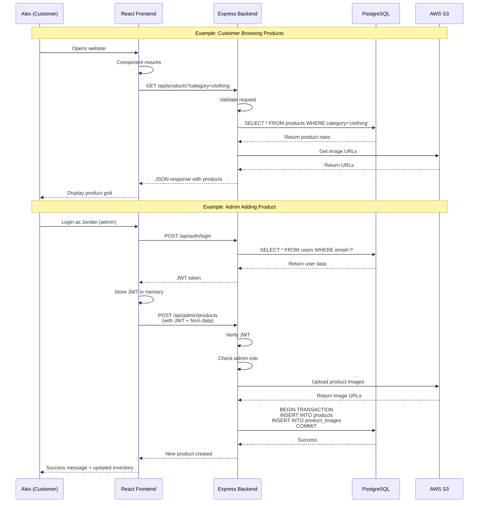
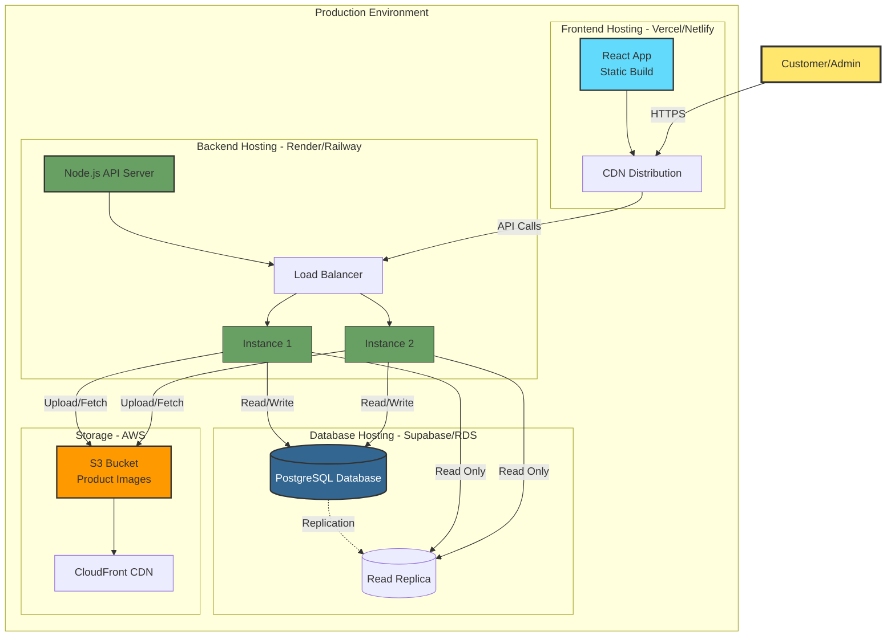

# System Architecture Diagram (Visual)

This diagram shows the three-tier architecture of Buckeye Marketplace.

```mermaid
graph TB
    subgraph "Client Tier - Frontend"
        A[React SPA<br/>Tailwind CSS]
        A1[Public Pages<br/>Catalog, Browse, Product Details]
        A2[User Portal<br/>Cart, Wishlist, Reviews]
        A3[Admin Portal<br/>Dashboard, Inventory, Orders]
        A --> A1
        A --> A2
        A --> A3
    end
    
    subgraph "Application Tier - Backend"
        B[Node.js + Express API Server]
        B1[Auth Routes<br/>Login, Register, JWT]
        B2[Product Routes<br/>CRUD, Search, Filter]
        B3[Cart Routes<br/>Add, Remove, Update]
        B4[Review Routes<br/>Create, Moderate]
        B5[Admin Routes<br/>Inventory, Orders]
        B6[Middleware<br/>JWT Verify, RBAC, Logging]
        
        B --> B1
        B --> B2
        B --> B3
        B --> B4
        B --> B5
        B --> B6
    end
    
    subgraph "Data Tier - Database"
        C[PostgreSQL Database]
        C1[Users Table]
        C2[Products Table]
        C3[Orders Table]
        C4[Reviews Table]
        C5[Cart Table]
        C6[Product Images Table]
        
        C --> C1
        C --> C2
        C --> C3
        C --> C4
        C --> C5
        C --> C6
    end
    
    subgraph "External Services"
        D[AWS S3 / Cloudinary<br/>Image Storage]
        E[Stripe<br/>Payment Processing<br/>Future Phase]
        F[SendGrid / AWS SES<br/>Email Service<br/>Future Phase]
    end
    
    A -->|HTTPS REST API<br/>JSON| B
    B -->|SQL Queries<br/>via ORM| C
    B -->|Upload/Retrieve Images| D
    B -.->|Future: Process Payments| E
    B -.->|Future: Send Emails| F
    
    style A fill:#61dafb,stroke:#333,stroke-width:2px,color:#000
    style B fill:#68a063,stroke:#333,stroke-width:2px,color:#fff
    style C fill:#336791,stroke:#333,stroke-width:2px,color:#fff
    style D fill:#ff9900,stroke:#333,stroke-width:2px,color:#000
    style E fill:#635bff,stroke:#333,stroke-width:2px,color:#fff
    style F fill:#1a82e2,stroke:#333,stroke-width:2px,color:#fff
```



## Data Flow Diagram



## Component Interaction Diagram

```mermaid
graph LR
    subgraph "Frontend Components"
        PC[Product Catalog]
        PD[Product Detail]
        SC[Shopping Cart]
        RV[Reviews]
        AD[Admin Dashboard]
    end
    
    subgraph "Backend API Endpoints"
        PE[/api/products]
        CE[/api/cart]
        RE[/api/reviews]
        AE[/api/admin/*]
        UE[/api/auth/*]
    end
    
    subgraph "Database Tables"
        PT[(Products)]
        CT[(Cart)]
        RT[(Reviews)]
        UT[(Users)]
        OT[(Orders)]
    end
    
    PC -->|GET| PE
    PD -->|GET by ID| PE
    SC -->|POST/PUT/DELETE| CE
    RV -->|POST/GET| RE
    AD -->|CRUD| AE
    
    PE --> PT
    CE --> CT
    RE --> RT
    AE --> PT
    AE --> OT
    UE --> UT
    
    style PC fill:#61dafb,stroke:#333
    style PD fill:#61dafb,stroke:#333
    style SC fill:#61dafb,stroke:#333
    style RV fill:#61dafb,stroke:#333
    style AD fill:#ff6b6b,stroke:#333
    
    style PE fill:#68a063,stroke:#333
    style CE fill:#68a063,stroke:#333
    style RE fill:#68a063,stroke:#333
    style AE fill:#ff6b6b,stroke:#333
    style UE fill:#68a063,stroke:#333
    
    style PT fill:#336791,stroke:#333
    style CT fill:#336791,stroke:#333
    style RT fill:#336791,stroke:#333
    style UT fill:#336791,stroke:#333
    style OT fill:#336791,stroke:#333
```

## Deployment Architecture



## Legend

- **Blue (React)**: Frontend components and UI
- **Green (Node.js)**: Backend API and business logic
- **Dark Blue (PostgreSQL)**: Database and data storage
- **Orange (AWS)**: External cloud services
- **Purple**: Payment services (future)
- **Light Blue**: Email services (future)
- **Red**: Admin-specific components/routes

## How to View

1. **In GitHub**: This diagram will render automatically when viewing the markdown file
2. **In VS Code**: Install "Markdown Preview Mermaid Support" extension
3. **Online**: Copy the mermaid code to https://mermaid.live

## Diagram Source Files

Save these diagrams in your documentation:
- `docs/diagrams/architecture.mermaid` - System architecture
- `docs/diagrams/dataflow.mermaid` - Data flow sequences  
- `docs/diagrams/deployment.mermaid` - Deployment architecture

